# To-Do Micro-SaaS

## Descrição

Esta é um micro-saas de gerenciamento de tarefas que permite aos usuários criar, atualizar, excluir e visualizar suas tarefas. O micro-saas também permite que os usuários filtrem e ordenem suas tarefas, além de marcar tarefas como concluídas ou pendentes. O login poderá ser feito com uma conta Google, GitHub ou por email através de um magic link em conjunto com o mailtrap, sendo necessário configurar as variáveis de ambiente no arquivo `.env`.

O micro-saas também utiliza o Stripe para processar pagamentos, permitindo que os usuários façam um upgrade no plano para conseguir criar mais tarefas. Para isso, é necessário a CLI do Stripe para ouvir os webhooks, para que o micro-saas receba a atualização do pagamento e do plano.

## Funcionalidades

-   **Criar Tarefa**: Adicione novas tarefas com um título.
-   **Excluir Tarefa**: Remova tarefas que não são mais necessárias.
-   **Visualizar Tarefas**: Veja todas as suas tarefas em uma tabela organizada e paginada.
-   **Filtrar Tarefas**: Filtre tarefas pelo título.
-   **Ordenar Tarefas**: Ordene tarefas por título.
-   **Marcar como Concluída**: Marque tarefas como concluídas ou pendentes.

## Tecnologias Utilizadas

-   **Next.js**: Framework React para construção da interface do usuário.
-   **TypeScript**: Linguagem de programação fortemente tipada.
-   **React**: Biblioteca para criação de interfaces de usuário.
-   **Tailwind CSS**: Framework CSS para estilização da interface do usuário.
-   **React Hook Form**: Biblioteca para gerenciamento de formulários.
-   **Shadcn/UI**: Biblioteca de componentes de interface do usuário acessíveis e personalizáveis.
-   **Prisma**: ORM para interagir com o banco de dados.
-   **Zod**: Biblioteca para validação de esquemas.
-   **Radix UI**: Componentes de interface do usuário acessíveis e personalizáveis.
-   **Stripe**: Plataforma de pagamentos para o micro-saas.
-   **Mailtrap**: Serviço de email para testes de integração com o micro-saas.
-   **Google OAuth**: Serviço de autenticação com o Google.
-   **GitHub OAuth**: Serviço de autenticação com o GitHub.
-   **Next-Auth**: Biblioteca para gerenciamento de autenticação.


## Como Utilizar

### Pré-requisitos

-   Node.js instalado na máquina.
-   Banco de dados configurado e rodando (ex: PostgreSQL).

### Passos para Rodar o Micro-SaaS

1. **Clone o repositório:**

    ```bash
    git clone https://github.com/viniciusleonel/micro-saas-sample
    cd seu-repositorio
    ```

2. **Instale as dependências:**

    ```bash
    npm install
    ```

3. **Configure as variáveis de ambiente:**

    Crie um arquivo `.env` na raiz do projeto e adicione as variáveis de ambiente necessárias, como as credenciais do banco de dados e as chaves de API.

    ```.env
     EMAIL_SERVER
     EMAIL_PORT
     EMAIL_USER
     EMAIL_PASSWORD
     EMAIL_FROM
     NEXT_PUBLIC_APP_URL
     DATABASE_URL
     AUTH_SECRET
     STRIPE_WEBHOOK_SECRET
     STRIPE_PUBLISHABLE_KEY
     STRIPE_SECRET_KEY
     AUTH_GITHUB_ID
     AUTH_GITHUB_SECRET
     GOOGLE_CLIENT_ID
     GOOGLE_CLIENT_SECRET
    ```

4. **Execute as migrações do banco de dados:**

    ```bash
    npx prisma migrate dev
    ```

5. **Inicie o servidor de desenvolvimento:**

    ```bash
    npm run dev
    ```

6. **Inicie o servidor de desenvolvimento do Stripe:**

    ```bash
    stripe listen --forward-to http://localhost:3000/api/stripe/webhook
    ```

7. **Acesse a aplicação:**

    Abra o navegador e vá para `http://localhost:3000`.


8. **Passo extra: Efetuar checkout**

    Ao entrar na página de checkout, a Stripe fornece um cartão para teste que pode ser utilizado:
    Número: 4242 4242 4242 4242
    Válidade: Qualquer data futura
    CVC: 123


### Estrutura do Projeto

-   **src/app**: Contém os componentes e páginas da aplicação.
-   **src/services**: Contém os serviços de autenticação e interação com o banco de dados.
-   **src/components**: Contém componentes reutilizáveis da interface do usuário.
-   **src/schema**: Contém os esquemas de validação Zod.
-   **src/types**: Contém definições de tipos TypeScript.

### Obs:
    No momento, a opção de login com email está desativada em produção.

### Imagens do Micro-SaaS

Aqui estão algumas capturas de tela da aplicação Micro-SaaS:

**Página de Login:**

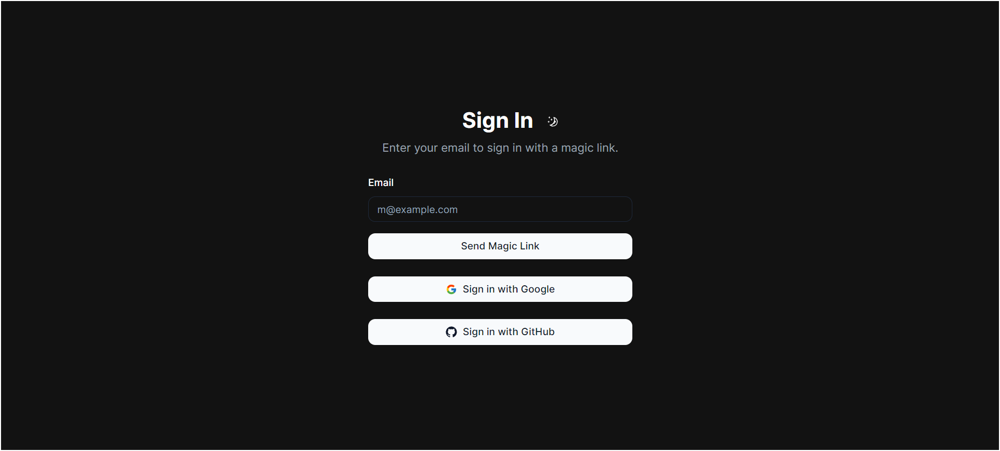

**Dashboard:**

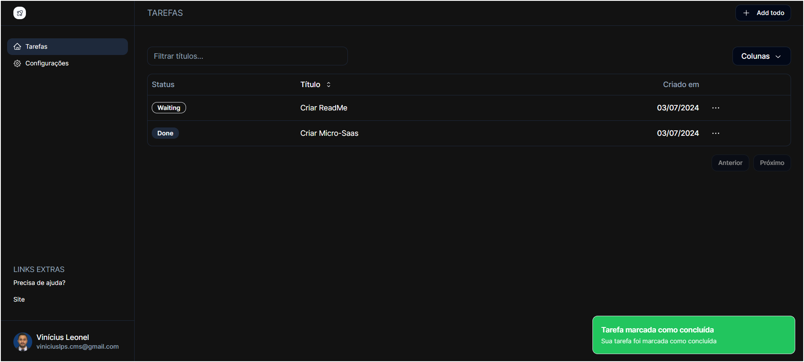

**Adicionar To-Do:**

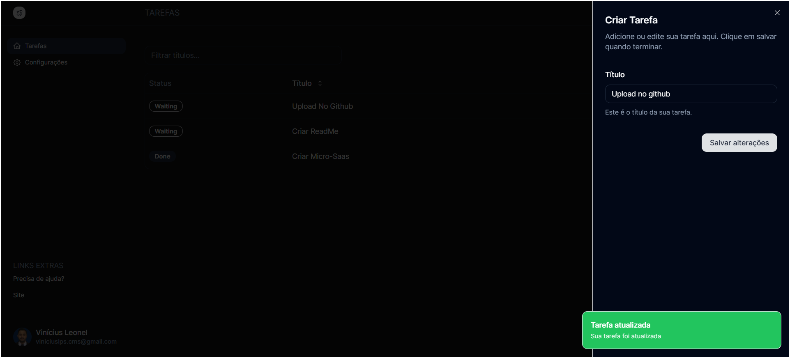

**Limite Plano Free:**

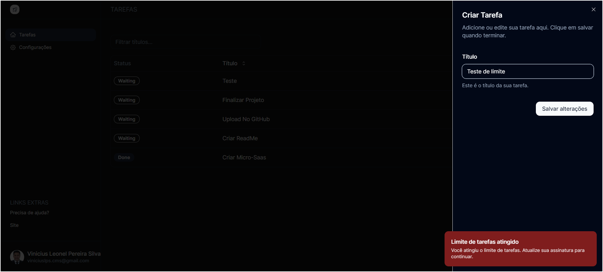

**Configuraçes de Perfil:**

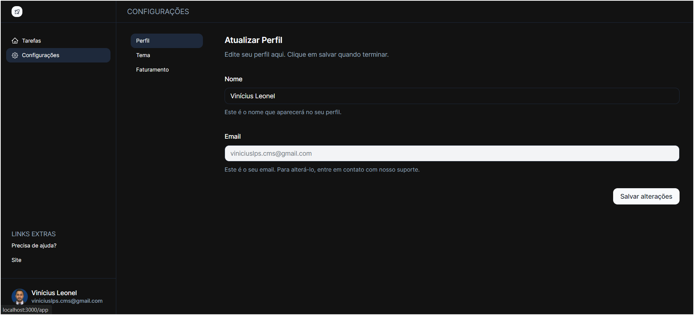

**Configuraçes do Tema:**

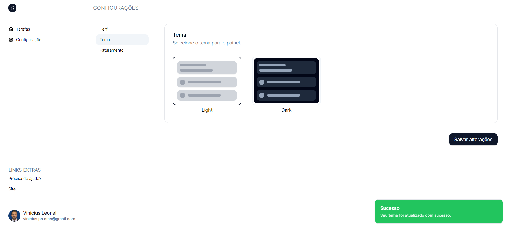

**Plano:**

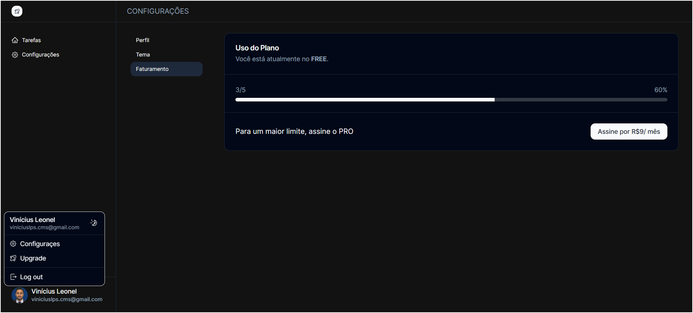

**Stripe:**

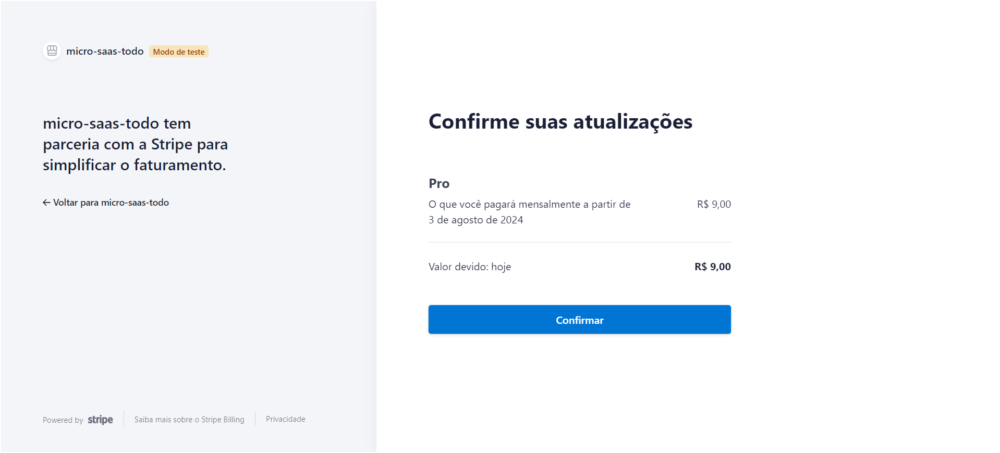

**Assinar Plano Pro:**

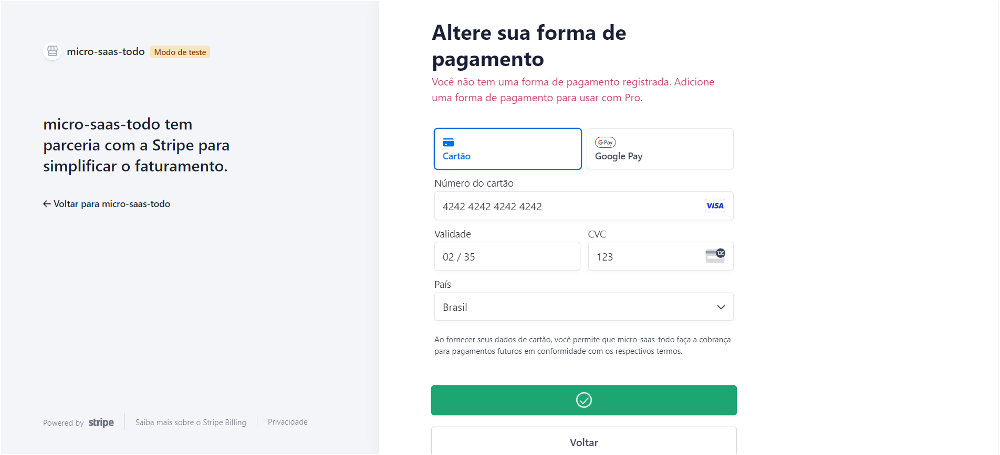

**Plano Pro:**

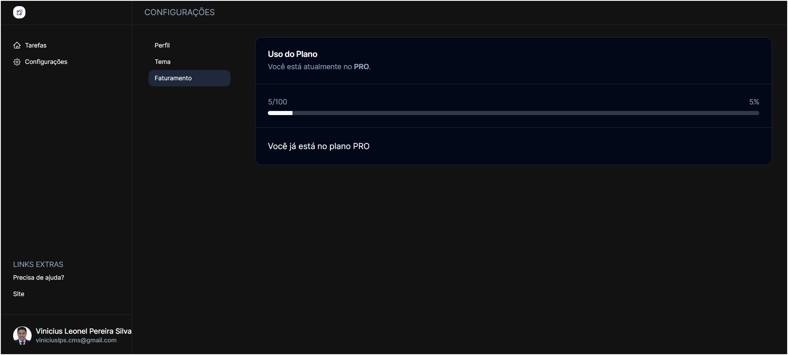


**Magic Link Login:**

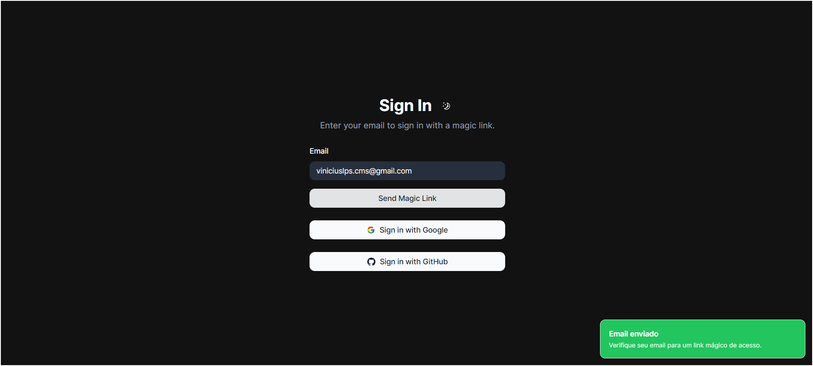
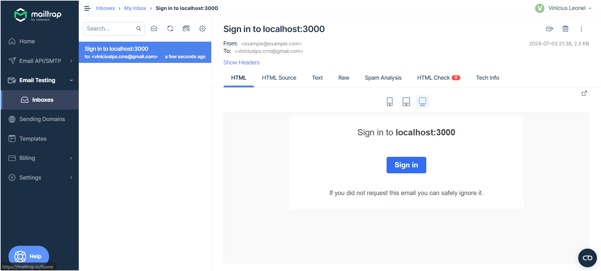

**GitHub Login:**

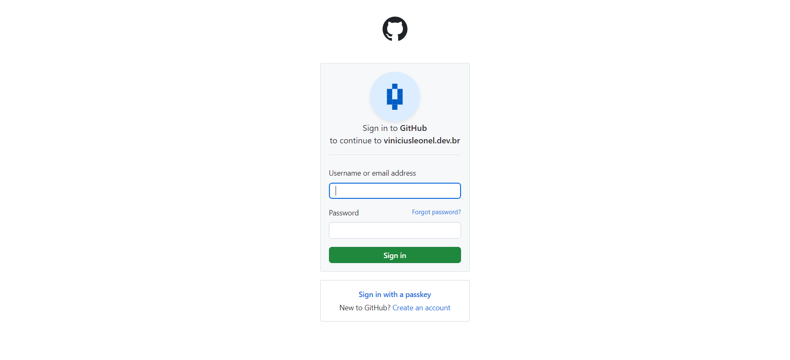

**Google Login:**

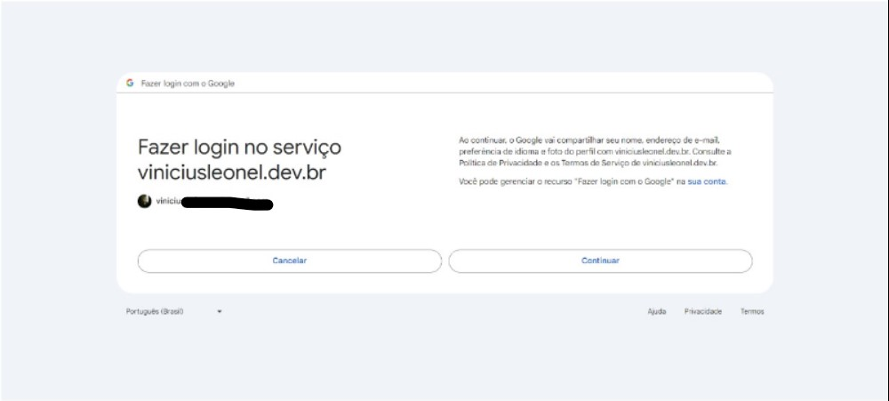